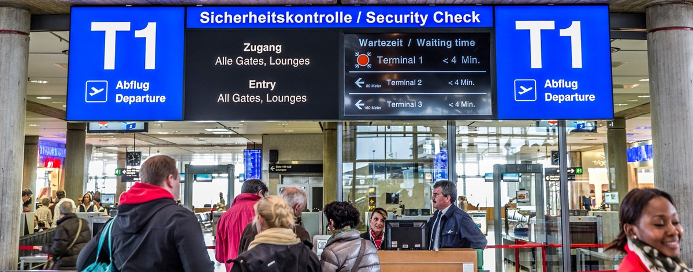

# The Kafka "minimum" security prison examples

This is a collection of minimum security permissions necessary to run Apache Kafka application such as:

* [Kafka Streams](kstreams/)
* [Monitoring](monitoring/)
* Kafka Connect (Pending)
* ...

Hopefully this will find answer a very common questions, which are the minimum ACL's I need to run this or this app inside the Apache Kafka ecosystem.

## Contributing

All contributions are welcome: ideas, patches, documentation, bug reports,
complaints, etc!

Programming is not a required skill, and there are many ways to help out!
